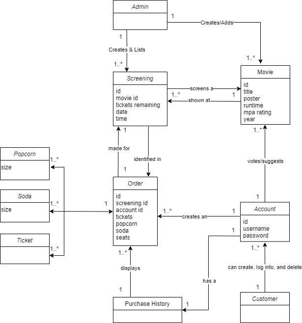
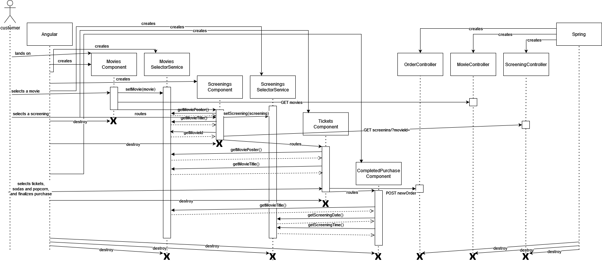
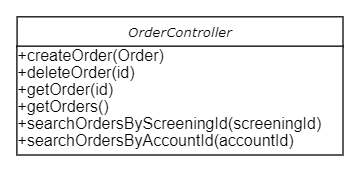

# PROJECT Design Documentation

## Team Information

* Team name: Group 3C, The Code Monkeys
* Team members
	* Adrian Cliteur
	* Gino Coppola
	* Louan Flammanc
	* Norton Perez
	* Oscar Rojas

## Executive Summary

This is the website for a small theater, only one actual theater, which screens "classic" movies.

### Purpose

This website allows users to buy tickets and snacks (soda and popcorn) to the screening of a movie at this movie theater.
The admin (theater owner) can edit screenings and change the movie shown at a screening.
The admin can also create new screenings of the existing movies.

### Glossary and Acronyms

| Term      | Definition                                |
|-----------|-------------------------------------------|
| Movie     | A film                                    |
| Screening | The showing of a movie at a movie theater |
| Order     | A purchase made by a user for a Screening |

## Requirements

This section describes the features of the application.

### Definition of MVP

The website allows users to purchase tickets to the screening of a movie.

### MVP Features

- Users can create an order of tickets to a movie screening, which may include soda and popcorn.
- Users can make accounts to make purchases and view their order history.
- Users can vote/suggest on new movies to be shown at a screening.

### Roadmap of Enhancements

- Users can create/log in to/delete their account.
- Users have the ability to select one of multiple movies to watch.
- Users can select the screening of a movie to attend.
- Users can select the number of tickets to purchase to a screening.
- Users can select an amount and size of popcorn and sodas they for a screening.
- Users can select a specific seat in the theater for each ticket they will purchase.
- Users can complete their purchase.
- Users can view their purchase history, when logged in.

- Admin can view all screenings of all movies.
- Admin can modify existing screenings.
- Admin can view what seats are already reserved for each screening.
- Admin can add and modify the movies that are being voted on.

## Application Domain

This section describes the application domain.

In our design, a Screening would display a Movie, which has various attributes specific to that movie.
A user can choose a Screening based on the date and time of the Screening.
Each Screening has a counter of tickets remaining so the product owner can prevent overbooking a Screening.

The checkout screen contains information about the tickets, soda and popcorn which a customer is buying for a Screening.
A customer cannot purchase tickets to multiple Screenings at once.

There must be at least 1 ticket to make an order, and there is at most 20 seats in a theater so the number of tickets cannot exceed 20.
Soda and popcorn is optional and a user can complete a checkout without purchasing any.

The customer must either make an account, or sign in to an existing account to make a purchase. The admin cannot create an Order.
A customer can also delete their account.
Once the customer is signed in, they can see the details of their previous orders.

## Architecture and Design

This section describes the application architecture.

### Summary

The following Tiers/Layers model shows a high-level view of the webapp's architecture.

The e-store web application, is built using the Model–View–ViewModel (MVVM) architecture pattern.

The Model stores the application data objects including any functionality to provide persistence.

The View is the client-side SPA built with Angular utilizing HTML, CSS and TypeScript. The ViewModel provides RESTful
APIs to the client (View) as well as any logic required to manipulate the data objects from the Model.

Both the ViewModel and Model are built using Java and Spring Framework. Details of the components within these tiers are
supplied below.

### Overview of User Interface

This section describes the web interface flow; this is how the user views and interacts with the e-store application.

The landing page displays all the movies a user can view at the theater.
The user can enter text into the search bar to filter the movies they see based on the movie title.

When logged in, a user can select a movie from the homepage which brings up a list of screenings for that movie.
Upon selecting a screening, the user can select a seat (thereby selecting a ticket) to purchase for a screening.
In the same page, a user can select the number of sodas and/or popcorn to purchase for the same screening.
The user can then finalize their purchase and is displayed a page with information about their order, the screening they have purchased tickets for.

There is a navigation header at the top of the webpage that contains the website title, a welcome splash text with the username,
and buttons based on the user logged in with the following functionality:
- The Login button routes to a page that allows a user to create an account, and sign in to their account.
- When logged in, the Login button turns into a Logout button.
- When logged in, a Home button to route to the landing page.
- When logged in, an Order button to route to a page that contains the user's purchase history and details of each order.
- When logged in, a Vote/Suggest button to route to the voting and suggesting page for future Screenings.
	- A user can vote on a movie any amount of times they want and can suggest a movie.
	-  The admin can add or change a movie but cannot vote.
- When logged in, a Delete Account button to delete their account from the persistence.

### View Tier

> _Provide a summary of the View Tier UI of your architecture.
> Describe the types of components in the tier and describe their
> responsibilities. This should be a narrative description, i.e. it has
> a flow or "story line" that the reader can follow._

> _You must also provide sequence diagrams as is relevant to a particular aspects
> of the design that you are describing. For example, in e-store you might create a
> sequence diagram of a customer searching for an item and adding to their cart.
> Be sure to include an relevant HTTP requests from the client-side to the server-side
> to help illustrate the end-to-end flow._

There are several components needed to handle the user purchase of tickets to a screening.

The landing page logic is located in the `Movies` component. This component retrieves all `Movie` objects using an HTTP GET request and displays them to the user.
The search functionality on the landing page also uses an HTTP GET request (with a query string)
to retrieve all the movies with the given phrase in their title. When the user selects a movie, that `Movie` object is stored with the `MovieSelectorService`.
The user is then routed to the `/screenings` page.

Similarly, the `Screenings` component retrieves all screenings for the selected movie using the `MovieSelectorService`
and an HTTP GET request with a query string. When the user selects a screening, that `Screening` object is saved in the `ScreeningSelectorService`.
The user is then routed to the `/tickets`page.

Once the user is on the landing page and is presented with the `Movie` objects, they may not select any `Screening` objects for purchase.
First, the user must click the Login button which routes them to the `/login` page.
The `Login` component presents the user with the ability to create an `Account` and sign in with the `Account` username.
The `Login` component uses an HTTP GET request to get an `Account` with the username entered.
If an `Account` with a matching username field exists, no `Account` will be created, if not, an HTTP POST request creates a new `Account` object with this username.
The `Login` component accepts a username and an HTTP GET request to check if an `Account` with the username exists,
then sets the `LoggedInAccountService` account field, then routes to the `/screenings` page.

Once the user has logged in using the `Login` sign in functionality, the `LoggedInAccountService` will keep track of this `Account` that is logged into.
Other components use this component to check if the `Account` that has been logged in is a user or an admin. Then the logout functionality untracks the user's `Account` to log out. 

The `Tickets` component presents allows the user to select the seats for a screening, the number of sodas and popcorn to order for the screening.
When the user finalizes their purchase using the button at the bottom of the page, the `Tickets` component sends
an HTTP POST request to the orders endpoint, adding that `Order` to the orders persistence. The user is then routed to the `/thank` page.

The `CompletedPurchase` component then presents the user with a summary of their order. Specifically, it displays information about the
selected movie and date and time of the screening using the `MovieSelectorService` and `ScreeningSelectorService`.

Once the user completes a purchase, the Orders button routes to `/purchase-history` page in which a detailed list of `Order` objects of that have the user's `Account` id field.
This is done by an HTTP GET request to get `Order` objects based on the accountId passed in.
For each `Order` a `Screening` is obtained by a similar HTTP GET request and is used to display the details of an `Order` object's `Screening`. 

The `VoteSuggestion` component presents the user with a list of movies that they can vote on, or add a new movie. It will use an HTTP GET request to get the movie,
and then use a PUT to add a vote to the movie.

The `VoteSuggestionAdmin` component presents the admin with a similar pge to the user. But, they will be able to use an HTTP PUT method to change the movie name.

The `AdminComponent` component presents the admin the ability to change inventory and change the vote/suggestions. For the inventory, they will use POST methods to 
create a new screening, and a PUT method to change the screening, and DELETE method to delete the screening.

### ViewModel Tier

The `ScreeningController` is used to respond to HTTP requests for `Screening` objects. There are methods that handle simple GET, POST, PUT, DELETE requests.
The POST and PUT requests require a `Screening` object as an argument, to insert into the storage of `Screening` objects.
The method `getScreeningsByMovieId` is used to find all `Screenings` for a `Movie`.
The `getScreeningsByMovieId` takes an argument representing a movie id to search for, and returns an array of all `Screenings` for that movie.
This method is used in the View Tier to display all screenings of a movie when a user is placing an order.

The `MovieController` is used to respond to HTTP requests for `Movie` objects. There are methods that handle simple GET, POST, PUT, DELETE requests.
The POST and PUT requests require a `Movie` object as an argument, to insert into the storage of `Movie` objects.
The `searchMovies` method takes an argument of a String to find all movies with a title that contains that string.
This method is used in the View Tier, providing the functionality of the homepage search bar.

The `SuggestionController` is used to respond to HTTP requests for `Suggestion` objects. There are methods that handle simple GET, POST, PUT, and DELETE requests.
The POST and PUT requests require a `Suggestion` object as an argument, to insert into the storage of a `Suggestion` objects.

The `AccountController` is used to respond to HTTP requests for `Account` objects.
This controller consists of methods that handle simple GET, POST, PUT, and DELETE requests.
The POST and PUT requests require an `Account` object as a parameter, to create or update an `Account` in the persistence.
The deleteAccount and getAccount methods require a String of the `Account` username field to DELETE or GET.

The `OrderController` is used to respond to HTTP requests for `Order` objects.
This controller consists of methods that handle GET, POST, and DELETE requests.
The POST request requires an `Order` object as a parameter, to create an `Order` in the persistence.
The deleteOrder and getOrder methods require an integer from the `Order` field `id` in order to DELETE, or GET the `Order` object, respectively.
The searchOrdersByScreeningId method GET an array of `Order` by matching the `screeningId` field of all `Order` objects with the `id` of a `Screening` object.
The searchOrdersByAccountId method GET an array of `Order` by matching the `accountId` field of all `Order` objects with the `id` of an `Account` object.

### Model Tier

The `Movie` model has fields relating to a movie. The `poster` field is the relative path to the poster of the movie
in the estore-ui folder. The `mpaRating` field is the Motion Pictures Association's rating for the movie, such as G, PG, PG-13 or R.

The `Screening` model has fields relating to the screening of a movie (indicated with `movieId` field), such as the date and time of the screening.
The `ticketsRemaining` field can never be higher than the `TOTAL_TICKETS` field in the `Screening` class. This number will decrement everytime
a user purchases tickets to a screening. The `seats` field is a 2D Array of booleans representing the 20 seats in the theater.
If a seat is already reserved by a user, it will have a value of `True` in the `seats` field. If the seat is empty, it will be `False`.

The `Suggestion` model has fields relating to the number of votes for the movie and the movie name. 
The `votes` field will be incremented by one everytime the user clicks on the button on the front end. 
The `movieTitle` field can be changed by the admin, and added by the user.

The `Account` model has fields that identify the user, such as the `id` and `username` fields.
A user's `id` is not known to them but is important for the model, to find accounts by id and each `Order` has this id as the `accountId`.
The `username` field is also unique, and is determined by the user on creation. Many components use this field to identify a user and allow them to login.
The user may also remove their account from persistence by entering `username` into the delete account functionality.
The `password` field is a string of characters determined by the user to log in with.

The `Order` model has fields that identify the `Account` that created the order and the `Screening` it points to, along with the rest of the fields that describe an `Order`.
The `id` field is a unique integer that is used to determine a unique `Order`. This is used for getting orders.
The `screeningId` field is used to identify the respective `Screening` of the `Order`. Screenings can be obtained by this id.
The `accountId` field is used to identify the `Account` that created the order.
The `tickets` field shows how many tickets a user has bought for a Screening, the `purchase-history` component displays this once the `Order` is gotten.
The `popcorn` and `soda` arrays are filled on creation of an `Order` which show how much small, medium, and large; popcorn or soda, was purchased, respectively.
This is also used by `purchase-history` to display this detail to the user.
The `seats` array is filled by a String determining the seat number, on creation of an `Order`.
This is displayed on the `tickets` component when ordering, and displayed in the `purchase-history` as the seats for each Screening order.

### Static Code Analysis

To perform a static analysis of our Java code, we used the Sonarqube tool. Our results are shown below.

We have 51 code smells, although mostly duplicate code smells across multiple files. Despite these code smells,
Sonarqube still gave our code an A across the four categories, indicating our code smells do not impact the quality of our code.
A breakdown of the 51 code smells is shown below.

Our 15 critical code smells are all duplicates. Throughout our 5 persistence files, used to load and save Java objects to a JSON file,
we have a method `load` to load the JSON objects. In this method, the static `id` field of the object being created is overwritten, so that the ids
are in order. However, this static field is modified from a non-static method, which is why sonarqube marks this as a critical code smell.

These 3 uses of the static `nextId` field are present in our 5 persistence files, thus 15 total repetitions of this critical code smell.
We elected not to look into correcting this because we don't think that the modification of the static field in a non-static context will be a problem for our estore.
If we were to expand on our project, then we would look into resolving this issue.

Our 33 major code smells were 2 problems throughout multiple files.

The first of which is our use of the `Logger` object, which accounted for 23/33 of the major code smells.

We decided not to address this issue because the `Logger` object is simply to display output about the requested HTTP command,
and is not contributing anything significant to the functionality of the project. If we were to expand on our project and increase our use of the `Logger` object,
then we would look into the proper way to log information to the command line.

The other 10/33 major code smells were due to the formatting of our JUnit Assertions.

We wrote our JUnit Assertions with arguments in the order `(actual, expected)` when the proper order is `(expected, actual)`.
Because this is simply a problem of conventional order, we decided to ignore this code smell.
Sonarqube only flagged the Assertions that had a straightforward actual value such as `assertEquals(expected, 3)`
and not the other Assertions that have an expected value based on the returned object of a method call such as `assertEquals(expected, screening.getId())`.
Therefore, this issue is likely present in all our unit tests. And considering our unit tests pass, going through and changing the order of the arguments
for the sake of following conventional standards would be a waste of time.

Our final 3 minor code smells are duplicates of the same issue.

Sonarqube recommends we replace our current use of the `@RequestMapping` annotation with an `@GetMapping` annotation,on the methods used to get objects with query parameters.
We originally were using the `@GetMapping` annotation on these methods, but we moved over to the `@RequestMapping` annotation so that a Controller class
could take multiple different query parameters. Because sonarqube marked this issue as a minor code smell, we will ignore these issues.

### Design Improvements

If we were to continue our project, we would look to improve our Angular design. We believe the current state of our Java code is of very high quality,
but our Angular structure could use improvement. None of us were familiar with Angular before we undertook this project,
so we have been learning as we go along. Now that we all have a much stronger foundation in Angular, we would go back and redesign some Components
and Services we created at the start of our project. We would also take the knowledge we now have of our design and use it
to create better Service methods that our Components can use, such as merging the `ScreeningSelectorService` and the `MovieSelectorService`.

If we were to continue, we'd also like to make our website design more uniform. Certain components are purely functional
at the moment, and our goal would be to style them to follow the design on the homepage.
We believe that website uniformity is important to ensuring a user likes our website, and thus encourages them to purchase tickets to a screening.

We may also look into adding unit testing of our Angular code, so we can identify further areas of improvement.

## Testing

### Acceptance Testing

Currently, the majority of our user stories have passed all acceptance criteria.
Only the stories that are still in development have not passed their acceptance criteria.
At the time of writing, this is the 10% reserve seats feature that is in development and the track snacks user story that is still in the sprint backlog.

The only concern we have is that we have missed a requirement for a story when designing our acceptance criteria.
For example, during the designing of our login user story, we did not explicitly state that a user must be logged in to delete their account.
Therefore, during the implementation, the delete button was implemented such that any user could delete any account as long as they knew the account's username.
We have since corrected this bug. However, we are now aware our acceptance criteria may have not been explicitly clear as to all that needed to be covered.
Therefore, it is possible current user stories pass all acceptance criteria but may still have bugs we did not consider during the design of the user story.

### Unit Testing and Code Coverage

We focused solely on writing unit tests for our Java RESTful API.
We aimed to have 95% code coverage for our code. We aimed for this number because we believe it is important to ensure our code is stable by
having high code coverage. It allows us to identify any bugs that arise and can inform of us of ways to improve our code.
To analyze our code coverage, we used the Jacoco tool, imported with Maven. Our results are shown below.

We have 99% code coverage. The missing 1% is from the entry point to the spring boot application.

The rest of our Java classes are at 100% code coverage. In terms of if statements, we are at 97% branch coverage.
The missing 3% is likely the same branch in 3 of our persistence files, the MovieJSONDAO, OrderJSONDAO and SuggestionJSONDAO.

We are not sure why this is a problem only for these 3 persistence classes and not for the AccountJSONDAO or ScreeningJSONDAO.
However, the missed branch will likely not cause any unexpected behaviors, and because it is likely the same missed branch in all 3 problematic
persistence files, we elected to ignore the missed branch.
